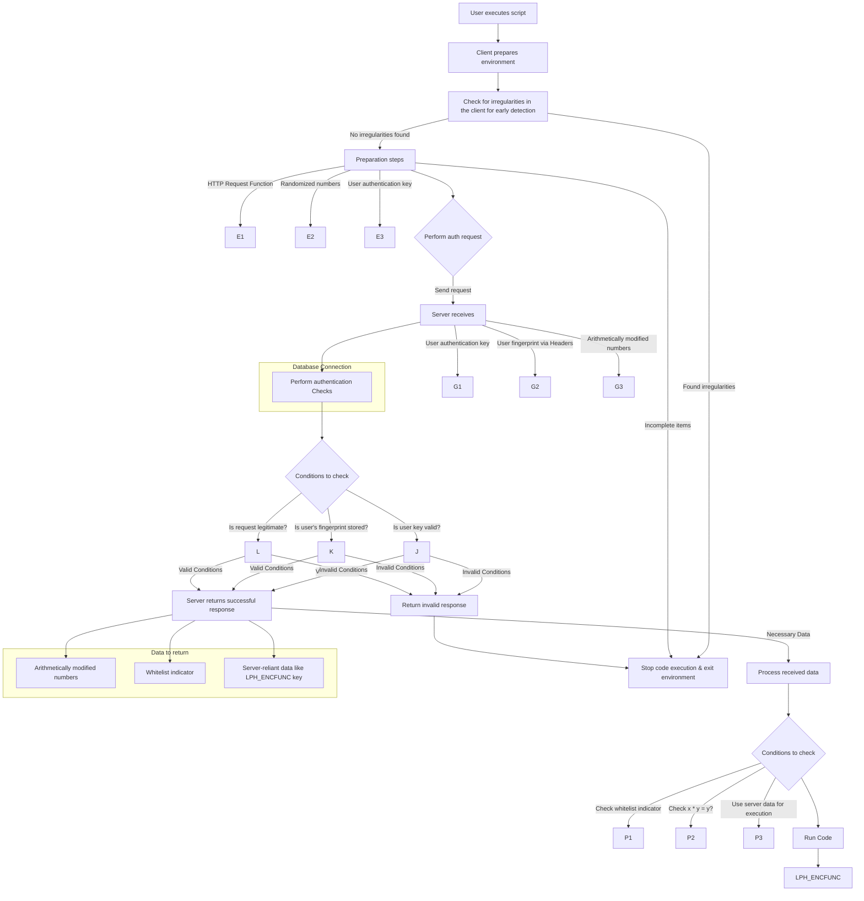

# RBLX-Whitelist
Source repo for my series on writing secure Authentication systems in Roblox  
- To read the guide, visit my [website](https://shiawase.dev/blog/rblx-auth1)

## Flowchart

  
Image Version

  
Mermaid (interactive) Version

# License
[MIT](/LICENSE)
